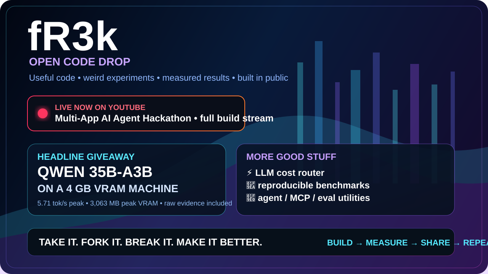

# fR3k Open Code Drop

> 🟢 **STREAM STATUS:** Back online — [watch the build live](https://youtube.com/live/xKOL36Yjs0U?feature=share).

[](https://youtube.com/live/xKOL36Yjs0U?feature=share)


<p align="center">
  
</p>

## 🔴 LIVE HACKATHON PROOF: three real apps, verified writes

The headline build is now a real **YouTube → GitHub → ntfy → GitHub evidence** agent, not a connector mock.

On the verified run, the runtime read the live YouTube stream, grounded GitHub issue #1, stopped for exact approval before the ntfy notification, reconciled the external receipt, stopped again before the GitHub evidence write, read that comment back exactly, and finished at **`CONFIRMED_SUCCESS` / evaluator `1.00`**.

**Receipts:** [`live-build/evidence/LIVE_MISSION_2026-09-14.md`](live-build/evidence/LIVE_MISSION_2026-09-14.md) · [`Issue #1`](https://github.com/fR3kdev/fR3k/issues/1)

```bash
cd agentic-action-engine
npm ci
npm run typecheck
npm test
npm run demo:live
```

`demo:live` performs real external writes only after the exact action is approved.

## Useful code. Strange experiments. No velvet rope.

This is the public **fR3k code drop**: runnable things I actually find useful, interesting, ridiculous, or all three at once.

If something here helps your build, take it. Fork it. Break it. Make it faster. Make it weirder. Ship it.

> **Current headline drop:** a reproducible **35B-A3B Qwen run on a machine with 4 GB VRAM**.

## 👁 Watch the hackathon build evolve

The competition workbench lives in **[`live-build/`](live-build/)**.

That folder is intentionally public and changes as the stream progresses. It contains the real four-world plan, runtime architecture, live status board, build log, evidence model, autonomy rules, and the current path toward the judged multi-app demo.

**Start here:** [`live-build/README.md`](live-build/README.md)

## 🔥 Qwen 35B-A3B on 4 GB VRAM

[`qwen-35b-on-4gb/`](qwen-35b-on-4gb/) contains the full Ollama benchmark/sweep kit used to run the 22.3 GiB Q4_K_M community model `huihui_ai/Qwen3.6-abliterated:35b-a3b` on a Quadro T1000 with **4 GB VRAM**.

### Recorded workstation result

| Metric | Result |
|---|---:|
| Peak generation | **5.71 tok/s** |
| Mean generation | **5.57 tok/s** |
| Peak VRAM | **3,063 MB** |
| Included short checks | **3 / 3 passed** |
| Contexts exercised | **up to 16K** |

**Important:** this is CPU/RAM + partial GPU offload. It is **not** a claim that the 22.3 GiB model fits entirely inside 4 GB VRAM. The measured rig also had 32 GB system RAM. The repo includes the raw result JSON, exact configs, prompts, harness, and report so you can inspect the receipts yourself.

```bash
cd qwen-35b-on-4gb
python3 harness/preflight.py
python3 -m venv .venv
.venv/bin/pip install -r requirements.txt
ollama pull huihui_ai/Qwen3.6-abliterated:35b-a3b
ALLOW_SYSTEM_OLLAMA_CHANGES=1 .venv/bin/python harness/sweep_ollama.py \
  --rig my-4gb-rig \
  --grid configs/workstation.grid.json \
  --suites short
```

The opt-in variable is deliberate. The sweep can adjust the local Ollama systemd service while testing KV-cache settings, so it does nothing like that silently.

## ⚡ Dependency-free LLM cost router

[`router.py`](router.py) is a tiny prompt-complexity router that chooses between cheap, mid-tier, and frontier model classes.

No key is needed just to inspect its decision:

```bash
python router.py "Design a multi-app agent with retries and idempotency"
```

Pricing changes. Check [`pricing.py`](pricing.py) before treating the included numbers as current production truth.

## 🧪 What belongs here

This repo is for things worth handing to another builder, not pitch-deck confetti:

- tiny agent utilities that actually run;
- local-model tricks and measured benchmarks;
- MCP / tool-calling helpers;
- evaluation and replay utilities;
- weird hardware/AI integrations;
- small scripts that save disproportionate amounts of pain;
- reproducible experiments with raw evidence attached.

## 📡 Built live

I’m building and breaking things publicly during the Multi-App AI Agent Hackathon.

**Watch:** https://youtube.com/live/xKOL36Yjs0U?feature=share

If you’re in the competition: **good luck. Steal anything useful from here.** That is literally why this repo exists.

## Licence / provenance

The router originated from the MIT-licensed [`fr3kchy/agent-cost-router-demo`](https://github.com/fr3kchy/agent-cost-router-demo).

The 4 GB Qwen kit was copied and hardened from [`fr3kchy/qwen36-bench`](https://github.com/fr3kchy/qwen36-bench). Original licences and attribution are preserved.

---

<p align="center"><b>BUILD → MEASURE → SHARE → REPEAT</b></p>
